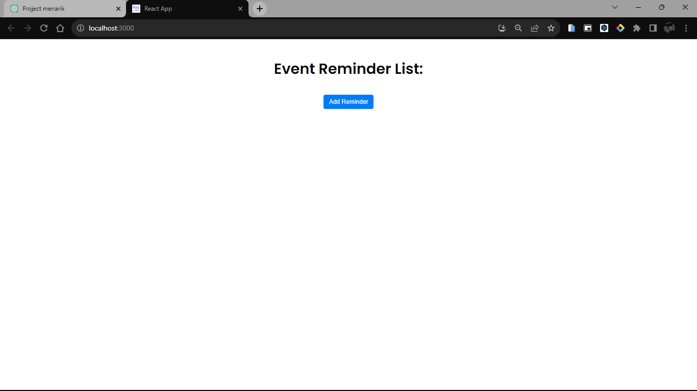
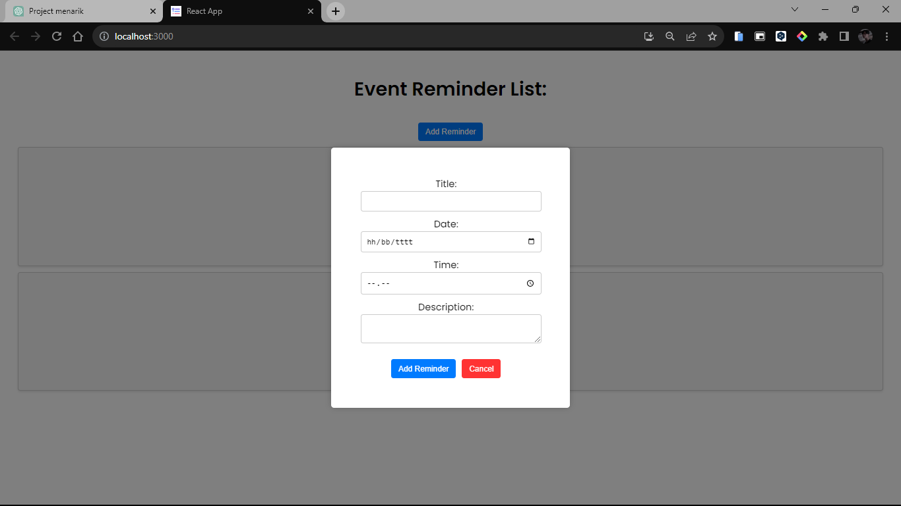
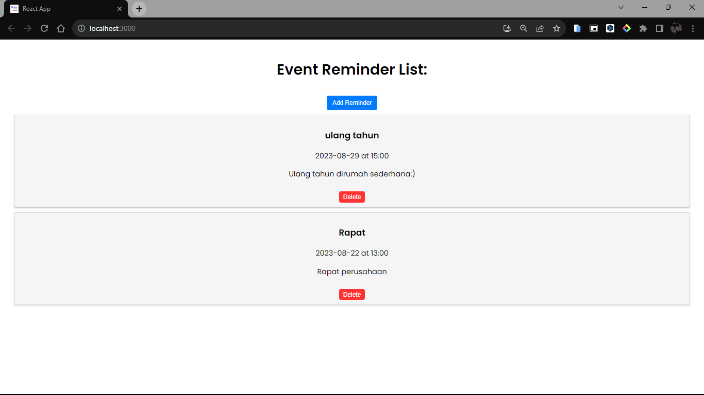

# Event Reminder App



Event Reminder App is a simple web application built with TypeScript and React that allows users to manage and keep track of their upcoming events and reminders.

## Features

- Add new reminders with a title, date, time, and description.
- View a list of reminders sorted by date and time.
- Delete reminders when they are no longer needed.
- User-friendly interface for a seamless experience.

## Getting Started

To run this project locally, follow these steps:

1. Clone the repository:
   ```bash
   git clone https://github.com/your-username/event-reminder-app.git
   cd event-reminder-app
   ```

2. Install dependencies:
   ```bash
   npm install
   ```

3. Start the development server:
   ```bash
   npm start
   ```

4. Open your browser and navigate to http://localhost:3000.

## Usage

- Click the "Add Reminder" button to open the reminder creation form.
- Fill in the details for your event, including the title, date, time, and description.
- Click "Submit" to add the reminder to your list.
- To remove a reminder, click the delete button on the reminder card.
- You can toggle the reminder creation form by clicking the "Add Reminder" button again or using the cancel button.

## Screenshots




## Technologies Used

- React: A JavaScript library for building user interfaces.
- TypeScript: A typed superset of JavaScript that compiles to plain JavaScript.
- CSS: Styling and layout.
- [Add other technologies used...]

## Contributing

Contributions are welcome! If you find a bug or want to add a new feature, please open an issue or submit a pull request.

## License

This project is licensed under the [MIT License](LICENSE).

---

Designed and developed by [Faisal Ardhani](https://github.com/FaisalArdhani).
